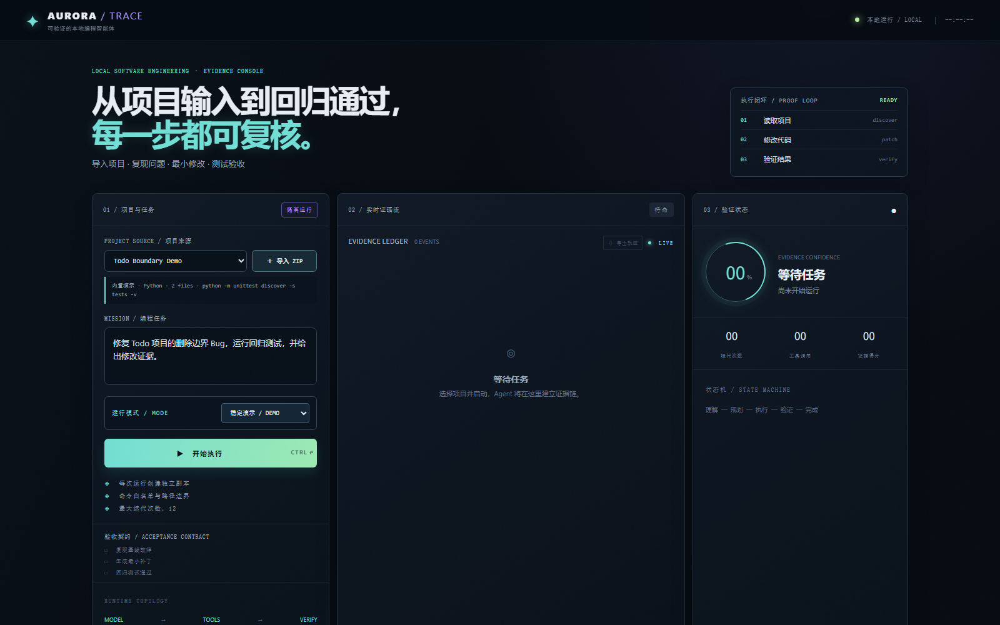

# AURORA TRACE

<p align="center">
  
</p>

<p align="center"><strong>Evidence-First Local Coding Agent</strong><br>Replayable, auditable execution for software-engineering tasks.</p>

<p align="center"><a href="README.md">简体中文</a> · <a href="README_EN.md">English</a></p>

<p align="center">
  
  
  
  
</p>

> 当前入口 / Current entry: `web/console.html`, served by `python aurora.py` at `http://127.0.0.1:8765`.

## 中文简介

AURORA TRACE 是一个面向软件工程任务的证据驱动型 Coding Agent 实验平台。它把每次运行组织成一条可解释、可验证、可追溯、可回放的闭环：

```text
模型决策 → 本地工具 → 真实结果 → 验证契约 → 证据记录 → 回放
```

项目不依赖 LangChain、LlamaIndex、OpenAI Agents SDK 或其他 Agent 框架。模型只负责提出下一步动作；本地执行器负责文件与命令操作；验收器负责判断任务是否真正完成。

<table>
<tr>
<td width="50%"><strong>🤖 Agent 决策</strong><br>模型一次只提出下一步动作，避免把未经验证的整段计划直接当成事实。</td>
<td width="50%"><strong>🔧 受限工具</strong><br>文件和命令通过本地 Tool Registry 与边界检查执行，工具结果原样回到运行上下文。</td>
</tr>
<tr>
<td><strong>📖 Evidence Ledger</strong><br>决策、参数、结果、Diff 和测试以父事件关系连接，运行记录可追溯、可导出、可回放。</td>
<td><strong>🔍 独立验收</strong><br>验收器依据真实命令证据判断是否完成，模型不能通过自由文本绕过完成条件。</td>
</tr>
</table>

## Problem and Design

普通 Coding Agent 往往把重点放在“生成了什么补丁”，但软件工程任务还需要回答三个问题：Agent 为什么采取这一步、工具到底执行了什么、最终结果是否有依据。AURORA TRACE 将这三个问题直接写入运行时结构，而不是在任务结束后再拼接日志。

一次运行由四类角色协作完成：模型提出下一步动作；Tool Registry 校验工具和参数；本地 Executor 执行文件与命令；Acceptance Contract 根据任务类型判断证据是否充分。每个动作都会产生带有父事件关系的结构化记录，形成“决策 → 工具 → 结果 → 验证”的因果链。

## Highlights

- **Evidence Ledger** — 记录决策、工具调用、文件变化和测试结果。
- **Adaptive Acceptance Contract** — 为 Bug 修复、功能新增、重构和普通变更选择不同验收策略。
- **Replayable Run** — 独立 run workspace、Diff、事件流和运行历史。
- **Verified Apply** — 验收通过后检查原项目状态，再写回最小已验证补丁并保留备份。
- **Guarded Workspace** — 文件边界、命令白名单、审批和超时控制。
- **OpenAI-compatible** — 可连接 OpenAI 兼容模型接口，模型适配层与本地执行层解耦。

## Why it is different

AURORA TRACE 把一次代码任务拆成四个可以单独检查的环节：

| 环节 | 负责内容 | 可检查产物 |
| --- | --- | --- |
| 决策 | 模型理解任务并选择下一步工具 | 决策理由、工具名称和参数 |
| 执行 | 本地执行器读写文件、运行命令 | 返回码、标准输出、受影响文件 |
| 验证 | 任务契约决定需要哪些测试和边界条件 | 基线、Diff、回归测试和安全检查 |
| 记录 | Evidence Ledger 保存因果关系 | 事件时间线、父事件、可回放记录 |

这种分离带来两个直接好处：失败时可以定位是决策、执行还是验证环节出了问题；成功时也能说明结果由哪些真实证据支撑，而不是只展示最终补丁。

## Quick Start

需要 Python 3.10 或更高版本；运行时仅使用 Python 标准库。

```powershell
cd aurora-trace
python aurora.py
```

打开 <http://127.0.0.1:8765>，选择项目和任务，点击 **开始受控运行 / Start Controlled Run**。

真实模型模式：

```powershell
$env:AURORA_MODE = "live"
$env:OPENAI_API_KEY = "your-key"
$env:OPENAI_BASE_URL = "https://api.openai.com/v1"
$env:AURORA_MODEL = "gpt-4o-mini"
python aurora.py
```

API Key 只从环境变量读取，不会写入仓库或运行记录。

## Demo Flow

默认演示修复 Todo 删除边界 Bug，并运行：

```powershell
python -m unittest discover -s tests -v
```

控制台会展示项目扫描、读取代码、形成基线、复现失败、应用补丁、重新测试、验收 Gate、证据时间线和 Replay。

## Console Overview



控制台将任务输入、证据流、代码变更、测试验收、置信度、验收 Gate 和运行历史放在同一个工作台中。每个区域都对应运行链上的一个可验证事实，点击面板可以查看更完整的结构化信息。

## Verification Model

验收契约不是固定的成功提示，而是随任务类型变化的验证策略：Bug 修复先要求观察修改前失败；功能新增、结构重构和一般变更先确认绿色基线。随后统一检查最小补丁、回归测试和工作区边界。只有真实命令结果进入证据账本后，完成状态才会被接受。

## Safety and Scope

每次运行都在隔离工作区中进行，原始项目不会被执行过程直接修改。文件访问不能越过工作区边界；命令执行使用白名单、`shell=False` 和超时控制；手动模式下，高风险操作需经过明确授权。项目用于研究可解释、可复现的工程 Agent 运行时，不宣称提供生产级沙箱或通用多智能体调度。

## Testing

核心安全与契约行为位于 `tests/`，可使用以下命令运行：

```powershell
python -m unittest discover -s tests -v
```

## Architecture

```text
Browser Console → HTTP API → Agent Controller → Model Adapter
                                      ↓
                              Contract Gate + Tool Registry
                                      ↓
                       Isolated Workspace + Evidence Ledger
```

## Documentation

| 文档 | 内容 |
| --- | --- |
| [ARCHITECTURE.md](ARCHITECTURE.md) | 分层架构、事件结构和系统边界 |
| [EVALUATION.md](EVALUATION.md) | 可复现实验协议与验收策略 |
| [DESIGN.md](DESIGN.md) | AURORA TRACE 与基础 Coding Agent 的差异 |
| [DESIGN_DECISIONS.md](DESIGN_DECISIONS.md) | 工程决策与取舍 |
| [README_EN.md](README_EN.md) | English project overview |

## Project Layout

```text
aurora.py                 # HTTP 服务、Agent 循环、工具、契约和模型适配器
web/console.html          # Evidence Workbench 控制台
seed_project/             # 故意含 Bug 的 Todo 演示项目
tests/                    # 安全、执行和契约测试
assets/                   # README 视觉资源
```

## Implementation Notes

- 使用 Python 标准库实现 HTTP 服务、Agent 循环、模型适配、工具注册、上下文预算和状态持久化。
- 使用结构化事件而不是自由文本日志，事件之间通过 `parent_event_id` 保留因果关系。
- 对 Bug 修复、功能新增、结构重构和一般变更采用不同基线策略，避免把“先复现失败”错误套用到所有任务。
- 运行记录同时支持实时展示、JSON 导出和只读回放，便于复核一次运行而不重新执行代码。

## Scope and Safety

AURORA TRACE 是可复现的工程实验平台，不是生产级沙箱或通用多智能体调度器。不可信项目应在专用目录或低权限环境中运行。

## License

MIT
