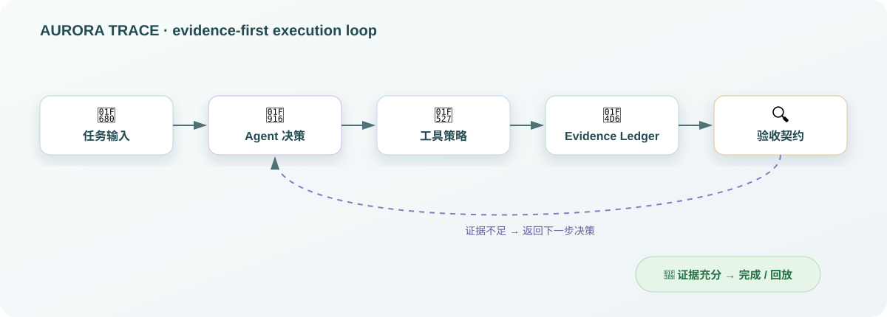
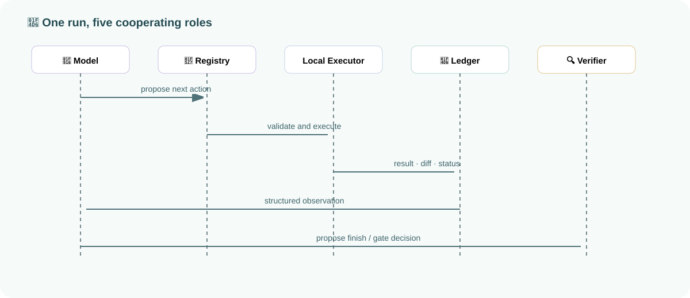

# AURORA TRACE

<p align="center">
  
</p>

<p align="center"><strong>Evidence-First Local Coding Agent</strong><br>Replayable, auditable execution for software-engineering tasks.</p>

<p align="center"><a href="README.md">简体中文</a> · <a href="README_EN.md">English</a></p>

<p align="center">
  
  
  
  
</p>

> Current entry point: `web/console.html`, served by `python aurora.py` at `http://127.0.0.1:8765`.

## 🌌 Overview

AURORA TRACE is an evidence-first Coding Agent runtime for software-engineering tasks. Each run is organized as an explainable, verifiable, traceable, and replayable loop:

```text
Model decision → Local tool → Real result → Acceptance contract → Evidence record → Replay
```

The project does not depend on LangChain, LlamaIndex, OpenAI Agents SDK, or another Agent framework. The model proposes one next action at a time; the local executor performs file and command operations; the verifier decides whether the task is actually complete.

<table>
<tr>
<td width="50%"><strong>🤖 Agent decisions</strong><br>The model proposes one next action at a time, so an unverified plan is never treated as fact.</td>
<td width="50%"><strong>🔧 Guarded tools</strong><br>Files and commands pass through a local Tool Registry and workspace-boundary checks; tool results return to the run context unchanged.</td>
</tr>
<tr>
<td><strong>📖 Evidence Ledger</strong><br>Decisions, parameters, results, diffs, and tests are connected by parent events for traceability, export, and replay.</td>
<td><strong>🔍 Independent verification</strong><br>The verifier uses real command evidence to determine completion; free-form model text cannot bypass the acceptance checks.</td>
</tr>
</table>

## 🧭 Problem and Design

Many Coding Agents focus on the patch they generated. Engineering work also needs to answer three questions: Why did the Agent take this step? What did the tool actually execute? What evidence supports the final result? AURORA TRACE writes these answers into the runtime structure instead of reconstructing them from logs after the task ends.

Each run has four cooperating roles: the model proposes the next action; the Tool Registry validates the tool and its arguments; the local Executor performs file and command operations; and the Acceptance Contract determines whether the evidence is sufficient for the task type. Every action creates a structured record with a parent-event link, forming a causal chain from decision to tool call, result, and verification.

## ✨ Highlights

- **Evidence Ledger** — Records decisions, tool calls, file changes, and test results.
- **Adaptive Acceptance Contract** — Selects different acceptance strategies for bug fixes, feature work, refactoring, and general changes.
- **Replayable Run** — Keeps an isolated run workspace, unified diff, event stream, and run history.
- **Verified Apply** — After acceptance, checks the source project state, writes back only the smallest verified patch, and keeps a backup.
- **Guarded Workspace** — Enforces file boundaries, command allowlists, approvals, and timeouts.
- **OpenAI-compatible** — Connects to OpenAI-compatible model gateways while keeping model adaptation separate from local execution.

## 💡 Why it is different

AURORA TRACE splits a coding task into four independently inspectable stages:

| Stage | Responsibility | Inspectable output |
| --- | --- | --- |
| Decision | Understand the task and choose the next tool | Rationale, tool name, and arguments |
| Execution | Read and write files or run commands locally | Exit code, stdout, and affected files |
| Verification | Select checks required by the task contract | Baseline, diff, regression tests, and safety checks |
| Recording | Preserve causal relationships in the Evidence Ledger | Timeline, parent events, and replay data |

This separation makes failures diagnosable: reviewers can tell whether a problem came from the decision, execution, or verification stage. It also makes success defensible because the final state is supported by concrete evidence rather than only a displayed patch.

## 🧩 At a glance

| 🤖 **Agent loop** | 🔧 **Tool boundary** | 📖 **Evidence graph** |
| --- | --- | --- |
| Handles one next action at a time, reads the result, and then decides what to do next. | Files, replacements, and commands pass through a registry, argument validation, and path policy. | Each event carries a timestamp, phase, and `parent_event_id`, so results can be traced back to their triggering decisions. |

| 🔍 **Verification** | 👤 **Human control** | 🚀 **Local-first** |
| --- | --- | --- |
| Baseline, patch, regression tests, and workspace safety jointly determine completion. | High-risk operations can pause for approval, and a running task can be cancelled cooperatively. | Runs on the Python standard library while keeping the model gateway and local executor clearly separated. |

## 🚀 Quick Start

Python 3.10 or newer is required; runtime dependencies are limited to the Python standard library.

```powershell
cd aurora-trace
python aurora.py
```

Open <http://127.0.0.1:8765>, choose a project and task, and click **Start Controlled Run**.

To use an OpenAI-compatible model gateway:

```powershell
$env:AURORA_MODE = "live"
$env:OPENAI_API_KEY = "your-key"
$env:OPENAI_BASE_URL = "https://api.openai.com/v1"
$env:AURORA_MODEL = "gpt-4o-mini"
python aurora.py
```

The API key is read only from the environment and is never written to the repository or run records.

## 🎬 Demo Flow

The built-in example demonstrates a Todo deletion boundary bug and runs:

```powershell
python -m unittest discover -s tests -v
```

The console shows project scanning, source reading, baseline capture, failure reproduction, patch application, regression testing, acceptance gates, the evidence timeline, and replay.



A run does not stop when the model produces code. The model proposes an action, the executor produces facts, the ledger records those facts, and the acceptance contract decides whether to continue or finish.

## 🔍 Task-aware verification

The same runtime supports several software-engineering task types, but completion is not hard-coded to one recipe:

| Task type | Before the change | After the change |
| --- | --- | --- |
| 🐛 Bug fix | Reproduce an observable failure | Minimal patch + regression tests |
| ✨ Feature work | Confirm the existing tests remain green | Feature tests + regression tests |
| 🧹 Refactoring | Confirm a stable pre-change baseline | Behavior preservation + regression tests |
| 📝 General change | Record the current baseline state | All contract-required checks pass |

Verification results enter the Evidence Ledger before they contribute to the completion score; a model `finish` message alone cannot bypass local checks.

## 🖥️ Console Overview


The console places task input, the evidence stream, code changes, test acceptance, confidence, acceptance gates, and run history in one workbench. Each panel corresponds to a verifiable fact in the execution chain, and can be opened for structured details.

## 📖 What is recorded

Every Run contains at least:

- **Decisions** — Selected tool, rationale, and target phase;
- **Execution** — Tool arguments, exit code, stdout, and affected files;
- **Changes** — Unified diff, file paths, and patch size;
- **Verification** — Baseline status, test cases, acceptance gates, and terminal state;
- **Relationships** — Timestamps, run identifier, and parent events for causal tracing and replay.



## ✅ Verification Model

The Acceptance Contract is a task-sensitive verification strategy, not a fixed success banner. Bug fixes first require an observed pre-change failure; feature work, refactoring, and general changes first establish a green baseline. The runtime then checks the minimal patch, regression tests, and workspace boundaries. Completion is accepted only after real command results have entered the Evidence Ledger.

## 🛡️ Safety and Scope

Each run executes in an isolated workspace, so the source project is not modified directly during execution. File access cannot leave the workspace boundary; commands use an allowlist, `shell=False`, and timeout controls. In manual mode, high-risk operations require explicit approval. The project is a research-oriented runtime for explainable and reproducible engineering Agents; it is not presented as a production sandbox or a general multi-Agent scheduler.

## 🧪 Testing

Core safety and contract behavior lives in `tests/` and can be exercised with:

```powershell
python -m unittest discover -s tests -v
```

## 🏗️ Architecture

```text
Browser Console → HTTP API → Agent Controller → Model Adapter
                                      ↓
                              Contract Gate + Tool Registry
                                      ↓
                       Isolated Workspace + Evidence Ledger
```

## 📚 Documentation

| Document | Contents |
| --- | --- |
| [ARCHITECTURE.md](ARCHITECTURE.md) | Layered architecture, event structure, and system boundaries |
| [EVALUATION.md](EVALUATION.md) | Reproducible evaluation protocol and acceptance strategies |
| [DESIGN.md](DESIGN.md) | How AURORA TRACE differs from a baseline Coding Agent |
| [DESIGN_DECISIONS.md](DESIGN_DECISIONS.md) | Engineering decisions and trade-offs |
| [README.md](README.md) | Simplified Chinese project overview |

## 🗂️ Project Layout

```text
aurora.py                 # HTTP service, Agent loop, tools, contracts, and model adapter
web/console.html          # Evidence Workbench console
seed_project/             # Todo fixture with an intentional boundary bug
tests/                    # Safety, execution, and contract tests
assets/                   # README visual assets
```

## ⚙️ Implementation Notes

- The HTTP service, Agent loop, model adapter, tool registry, context budget, and state persistence use the Python standard library.
- Structured events replace free-form logs; `parent_event_id` preserves causal relationships between events.
- Bug fixes, feature work, refactoring, and general changes use different baseline policies, so “reproduce a failure first” is not incorrectly applied to every task.
- Run data supports live display, JSON export, and read-only replay, allowing a run to be reviewed without executing the code again.

## 📌 Project Status

The current version focuses on explainable execution for one controlled Run. It prioritizes clear boundaries, structured records, and reproducible paths for every file operation, command call, and verification result. Production-grade container isolation, general multi-Agent scheduling, and a plugin ecosystem are outside the current scope.

## 📄 License

MIT
